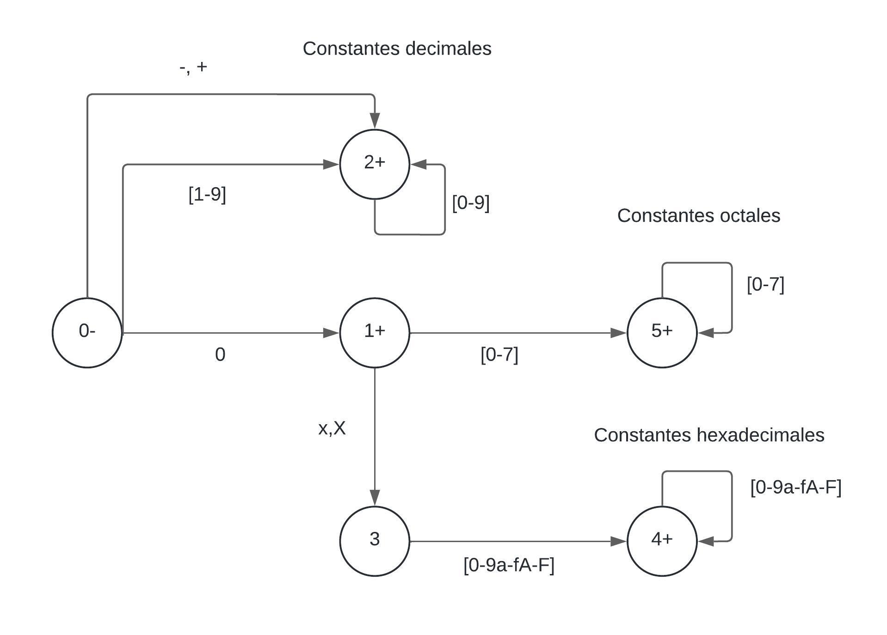
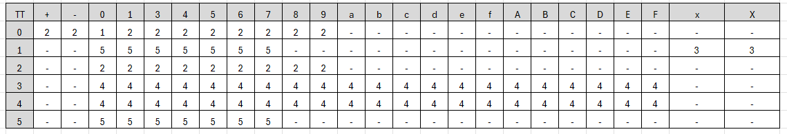
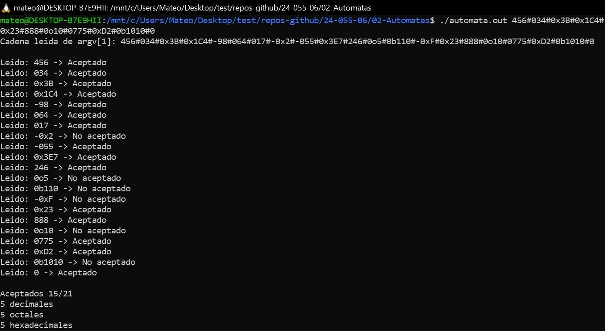
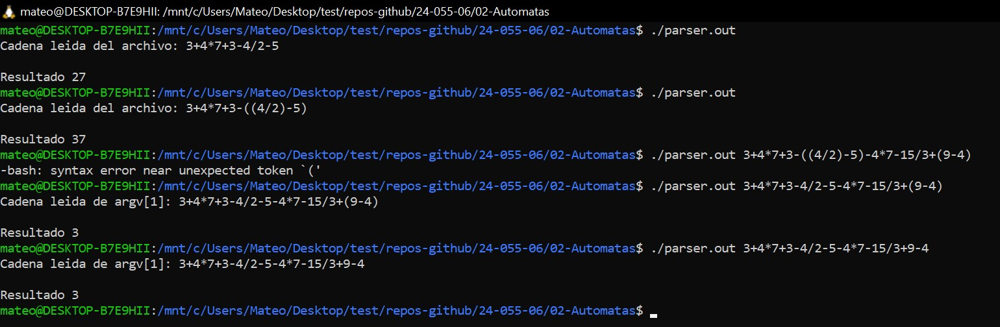

# <span style="color: white;">📝 TP N2 - Autómatas</span>

## Punto 1: <span style="color: orange;"> Autómata para constantes de C</span> 🎯  

### Descripción
Dada una cadena que contiene varios números (decimales, octales o hexadecimales), con o sin signo para los decimales, separados por el carácter `#`, se debe:
1. Reconocer los tres grupos de constantes enteras.
2. Indicar si hubo un error léxico.
3. Contar la cantidad de cada grupo.

### Detalles Implementados
- **Ingreso de cadena**: La cadena puede ingresarse por línea de comando [(argv)](https://ccia.ugr.es/~jfv/ed1/c/cdrom/cap6/cap64.htm) o por archivo.
- **Función de transición**: Se uso una función de transición para gestionar los estados del autómata.

### Diagrama de autómatas y matrices de transición

#### Autómata utilizado


#### Matriz de transición

---
### Ejemplos de uso
#### Cadena desde el [archivo](https://github.com/utn-frba-ssl/24-055-06/blob/387a2999a643755065df21eeeac82f127af4b2b8/02-Automatas/cadena.txt)
${\color{red}IMPORTANTE: }$
El archivo debe ser una única línea sin newline  al final

#### Cadena desde la terminal

---

## Punto 2: <span style="color: orange;">Char numérico a int</span> 💻

### Descripción
Se debe implementar una función que reciba un carácter numérico y retorne su valor como un número entero.

### Función implementada
En C los char se representan en código ASCII lo único que hay que hacer para convertirlo en un int es correr el índice restandole el elemento inicial, el '0'.
```c
int to_int(char c) {
    return c-'0'
}
```
---

## Punto 3: <span style="color: orange;">Parser eval()</span> ➕➖➗

### Descripción
Ingresar una cadena que represente una operación aritmética simple entre enteros decimales. Los operadores permitidos son `+`, `-`, `*`, `/`. Ejemplo: `3+4*7+3-8/4` debe devolver `32`. El parser debe:

- Convertir los caracteres a números utilizando la función del Punto 2.
- Respetar la precedencia de los operadores aritméticos.

### Implementación
1. **Parser de operaciones**: Se implementó un parser que analiza la cadena y realiza las operaciones en el orden correcto.
2. **Precedencia**: El parser respeta la precedencia de multiplicación y división sobre suma y resta.

### Explicación detallada 
Implementamos un Parser guiándonos del fuente del [Descent Parser](https://github.com/utn-frba-ssl/24-055-06/blob/d4fb71f8789066a6f91ec054d31c4a271a1718b4/02-Automatas/descentParser.c), el cual encontramos en StackOverFlow [(Como evaluar Expresiones de un char* en C)](https://stackoverflow.com/questions/14472680/how-to-get-and-evaluate-the-expressions-from-a-string-in-c)

El algoritmo comienza leyendo la cadena desde un Archivo o desde los argumentos pasados por terminal al Main.

- Usando recursividad fuimos descomponiendo el char* en tres partes
  1.  <span style="color: violet;">parse_expression()</span> -> descompone la expresión en términos.
  2. <span style="color: violet;">parse_term()</span> -> maneja multiplicaciones y divisiones.
  3. <span style="color: violet;">parse_factor()</span> -> evalua los paréntesis. 
   
- Para cada número, usamos parse_number(), que llama a la función del punto 2 y convierte un char numérico en int
- Al final el Parser retorna el resultado numérico de la expresión evaluada.

### Ejemplos de uso
#### Cadena desde el terminal y [archivo](https://github.com/utn-frba-ssl/24-055-06/blob/40f389762541150fb63b6de5428ae832283b6868/02-Automatas/operandos.txt)
${\color{red}IMPORTANTE: }$
El archivo debe ser una única línea sin newline  al final


### Fuentes 📚
- [eval() expressions in c](https://stackoverflow.com/questions/14472680/how-to-get-and-evaluate-the-expressions-from-a-string-in-c)

- [Top Down Parsers video](https://www.youtube.com/watch?v=iddRD8tJi44)

- [Recursive Descent Parser](https://en.wikipedia.org/wiki/Recursive_descent_parser)
